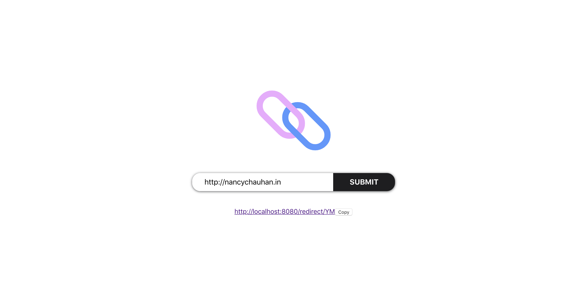

# URL Shortener 🔗

## Pre-requisites

1. Java 14 ☕
2. NodeJS
3. Yarn 🐱
4. docker 🐳

## Getting Started

1. 🖥️ cd into server and run `./gradlew bootRun`
2. ⚡ cd into client and run `yarn start`

## Screenshot 

